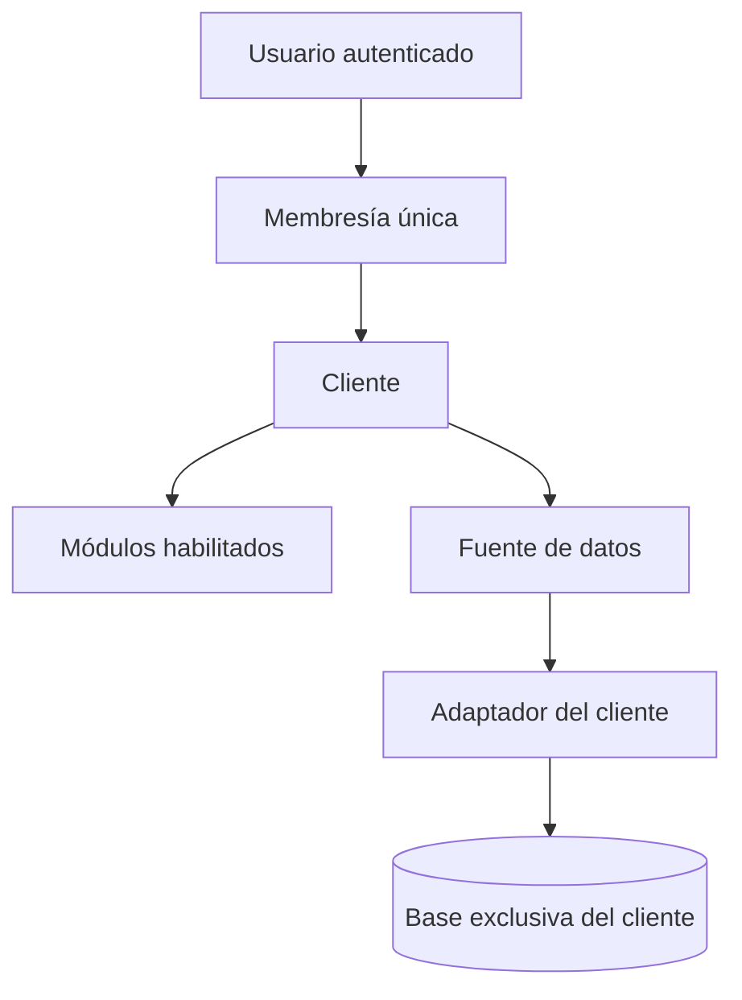

# OSIRIS 1.0

Plataforma Django multiempresa para consultar sensores y módulos operativos. Cada usuario
pertenece a un único cliente; cada cliente declara una fuente de datos independiente y solo
puede acceder a los módulos que un administrador habilite.

## Arquitectura



La base central de OSIRIS contiene usuarios, clientes, membresías, módulos y alias de
conexión. Las credenciales de las bases de sensores **no** se guardan en Django Admin:
se cargan desde un archivo JSON protegido o una variable de entorno. La selección de la
base nunca proviene de un parámetro HTTP.

El adaptador `aranet` consume el esquema normalizado creado por `api_aranet`:

- `aranet.sensor` y `aranet.sensor_capability` para descubrir dispositivos y métricas.
- `aranet.measurement` para series agregadas dentro de PostgreSQL.
- `aranet.v_sensor_status` para batería, señal y última telemetría.
- `aranet.v_active_alarms` para alertas.

## Arranque local

Requiere Python 3.12+ y PostgreSQL para consultar Aranet.

```bash
python3 -m venv .venv
source .venv/bin/activate
pip install -r requirements-dev.txt
cp .env.example .env
python manage.py migrate
python manage.py createsuperuser
python manage.py runserver
```

Django no carga `.env` automáticamente. Exporte las variables con el mecanismo de su
shell, systemd, Docker o plataforma de despliegue.

## Conectar el cliente Aranet

En producción, cree primero una base central pequeña para la configuración de OSIRIS:

```sql
CREATE ROLE osiris_app LOGIN PASSWORD 'replace-me-too';
CREATE DATABASE osiris_platform OWNER osiris_app;
```

Configure `OSIRIS_DB_NAME=osiris_platform` y las demás variables `OSIRIS_DB_*`. Esta base
no almacena mediciones; únicamente usuarios, clientes, permisos, soporte y auditoría de
control.

1. Cree un rol PostgreSQL exclusivo de solo lectura para Aranet. Ejecute como
   administrador y cambie la contraseña de ejemplo:
   la contraseña de ejemplo:

```sql
CREATE ROLE osiris_aranet_reader LOGIN PASSWORD 'replace-me';
GRANT CONNECT ON DATABASE agro_platform TO osiris_aranet_reader;
GRANT USAGE ON SCHEMA aranet TO osiris_aranet_reader;
GRANT SELECT ON ALL TABLES IN SCHEMA aranet TO osiris_aranet_reader;
ALTER DEFAULT PRIVILEGES IN SCHEMA aranet
    GRANT SELECT ON TABLES TO osiris_aranet_reader;
ALTER ROLE osiris_aranet_reader SET default_transaction_read_only = on;
```

2. Copie `config/client_databases.example.json` a una ruta fuera del repositorio, por
   ejemplo `/etc/osiris/client_databases.json`, complete las credenciales y restrinja el
   archivo:

```bash
sudo install -d -m 750 /etc/osiris
sudo install -m 640 config/client_databases.example.json /etc/osiris/client_databases.json
export OSIRIS_CLIENT_DATABASES_FILE=/etc/osiris/client_databases.json
```

El alias del ejemplo es `aranet_db`. Puede usarse la variable
`OSIRIS_CLIENT_DATABASES_JSON` en despliegues con un gestor de secretos; no configure
ambas opciones a la vez. Para una base remota use `"SSLMODE": "verify-full"` y configure
`SSLROOTCERT` con la CA correspondiente.

3. Cree el cliente y su primer usuario. Omitir `--password` crea una cuenta sin clave
   utilizable para asignarla de forma segura desde Django Admin o con `changepassword`:

```bash
python manage.py bootstrap_client \
  --name Aranet \
  --slug aranet \
  --db-alias aranet_db \
  --adapter aranet \
  --username aranet_admin \
  --email admin@example.com \
  --modules dashboard

python manage.py changepassword aranet_admin
python manage.py check_client_source --client aranet
```

## Configuración desde Django Admin

Ingrese en `/admin/` con un superusuario:

1. En **Clientes**, cree o abra el cliente.
2. En **Fuente de datos**, seleccione el adaptador y escriba exactamente el alias definido
   en el JSON protegido. El campo `settings` admite solo opciones no secretas, como
   `{"default_range": "7d"}`.
3. En **Módulos habilitados**, agregue las funciones visibles y su nivel mínimo:
   `Consulta`, `Operador` o `Administrador del cliente`.
4. Cree el usuario con el administrador estándar de Django.
5. En **Membresías**, relacione el usuario con un único cliente y asigne su nivel.

El inicio de sesión antiguo no se utiliza. La migración de esta rama invalida sus claves
guardadas en texto plano; cree las cuentas Django antes de entregar acceso a los clientes.

Ocultar un módulo no es la única defensa. Todas las rutas usan una comprobación de acceso
del lado del servidor, por lo que una URL escrita manualmente también queda bloqueada.
El aprovisionamiento inicial habilita solo `dashboard`; los módulos heredados deben
activarse únicamente después de confirmar que su lógica de datos es adecuada para ese
cliente.

## Agregar un cliente con otro esquema

No se configura SQL arbitrario desde el administrador. Para cada estructura nueva se crea
un adaptador revisable y probado que implemente `SensorDataAdapter`:

```text
list_sensors
list_metrics
latest_values
time_series
active_alarms
```

Pasos:

1. Crear `aplicaciones/dashboard/adapters/<cliente>.py`.
2. Normalizar sus resultados al contrato del dashboard.
3. Registrar el adaptador en `adapters/registry.py` y en las opciones de
   `ClientDataSource.Adapter`, junto con su migración.
4. Añadir pruebas de consultas parametrizadas, aislamiento y datos faltantes.
5. Declarar un alias/rol de solo lectura para la nueva base y asignarlo al cliente.

Así, el dashboard se adapta a las métricas disponibles sin exigir que dos clientes tengan
las mismas tablas, columnas o tipos de sensor.

## Validación y despliegue

```bash
python manage.py check
python manage.py test
ruff check .
python manage.py collectstatic --noinput
OSIRIS_ENV=production python manage.py check --deploy
gunicorn osiris_dev.wsgi:application --bind 127.0.0.1:8000 --workers 3
```

En producción son obligatorios `OSIRIS_SECRET_KEY`, hosts válidos, HTTPS y una base central
PostgreSQL configurada con `OSIRIS_DB_*`. Ejecute migraciones solo sobre la conexión
`default`; las bases de sensores son externas y OSIRIS no administra sus tablas.

## Pruebas incluidas

- Relación de un usuario con un solo cliente.
- Visibilidad y bloqueo directo de módulos.
- Resolución del cliente exclusivamente desde la sesión autenticada.
- Rechazo de IDs de sensores ajenos.
- Namespaces de caché separados por cliente y fuente.
- Consultas Aranet parametrizadas.
- Credenciales ausentes de la base central.
